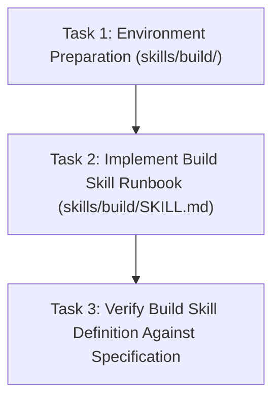

# 📋 Implementation Plan: Build Skill (`skills/build/SKILL.md`)

## Description
Establish the `build` skill (`skills/build/SKILL.md`) as the core execution engine of the Sandcastles Skills harness. Enforce a disciplined 4-phase loop (Implement → Verify → Commit → Check-off) for every task item, ensuring minimal touch, 5-line confirmation previews, empirical verification, per-task git commits, and todo progress check-offs.

## Phased Plan

### Phase 1: Environment & Directory Preparation
- **Goal**: Create directory structure `skills/build/`.
- **Acceptance Criteria**: `skills/build/` directory exists.

### Phase 2: Build Skill Protocol Implementation
- **Goal**: Author `skills/build/SKILL.md` containing complete execution loop rules, scope boundary controls, 5-line preview rules, git commit rules, and dynamic subagent/skill delegation guidelines.
- **Acceptance Criteria**: `skills/build/SKILL.md` created with YAML frontmatter and standard runbook sections.

### Phase 3: Verification & Alignment Audit
- **Goal**: Audit `skills/build/SKILL.md` against `ai-work/spec/skill-build-spec.md` and workspace rules (`GEMINI.md`).
- **Acceptance Criteria**: 100% specification alignment verified.

## Cost Estimates

| Phase | Estimated Input Tokens | Estimated Output Tokens | Estimated Cost (USD) |
|---|---|---|---|
| Phase 1: Environment Preparation | ~1,000 | ~200 | < $0.01 |
| Phase 2: Build Skill Implementation | ~4,000 | ~1,500 | < $0.01 |
| Phase 3: Verification & Alignment Audit | ~2,000 | ~500 | < $0.01 |
| **Total** | **~7,000** | **~2,200** | **< $0.01** |

## Precedence Graph

