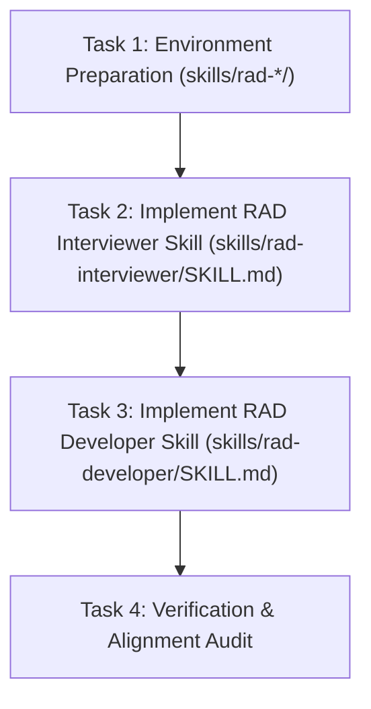

# 📋 Implementation Plan: RAD Skills Suite (`rad-interviewer` & `rad-developer`)

## Description
Establish the two-skill Rapid Application Development (RAD) suite within `skills/`:
1. `skills/rad-interviewer/SKILL.md`: Interactive zero-assumption architectural interview skill that produces a standardized, production-ready SQL schema file (`schema.sql`).
2. `skills/rad-developer/SKILL.md`: Deterministic blueprint-driven generation engine (Option B) for Symfony 6.4 LTS, featuring preflight checks, Doctrine ORM with N+1 prevention, EasyAdmin 4 with autocomplete relations, and Twig + Vite + SCSS frontend.

## Phased Plan

### Phase 1: Environment Preparation
- **Goal**: Create directory structures `skills/rad-interviewer/` and `skills/rad-developer/`.
- **Acceptance Criteria**: Both directories exist on the filesystem.

### Phase 2: Implement RAD Interviewer Skill
- **Goal**: Author `skills/rad-interviewer/SKILL.md` defining zero-assumption entity inquiry, property/validation interview protocols with explicit options, relationship cardinality/cascade rules, and SQL DDL file generation.
- **Acceptance Criteria**: `skills/rad-interviewer/SKILL.md` created with YAML frontmatter, execution protocols, and scope boundaries.

### Phase 3: Implement RAD Developer Skill
- **Goal**: Author `skills/rad-developer/SKILL.md` defining preflight checks, read-only DB/SQL schema ingestion, Option B blueprint generation (Entities with strict typing/validation, Repositories with eager joins, EasyAdmin 4 CRUD with autocomplete, Twig + Vite + SCSS frontend), and ecosystem skill integration.
- **Acceptance Criteria**: `skills/rad-developer/SKILL.md` created with YAML frontmatter, execution protocols, and scope boundaries.

### Phase 4: Verification & Audit
- **Goal**: Verify both skill runbooks against `ai-work/spec/skill-rad-interviewer-spec.md` and `ai-work/spec/skill-rad-developer-spec.md`.
- **Acceptance Criteria**: 100% specification alignment verified.

## Cost Estimates

| Phase | Estimated Input Tokens | Estimated Output Tokens | Estimated Cost (USD) |
|---|---|---|---|
| Phase 1: Environment Preparation | ~1,000 | ~200 | < $0.01 |
| Phase 2: RAD Interviewer Skill | ~4,000 | ~1,200 | < $0.01 |
| Phase 3: RAD Developer Skill | ~6,000 | ~2,000 | < $0.01 |
| Phase 4: Verification & Audit | ~2,000 | ~500 | < $0.01 |
| **Total** | **~13,000** | **~3,900** | **< $0.01** |

## Precedence Graph

